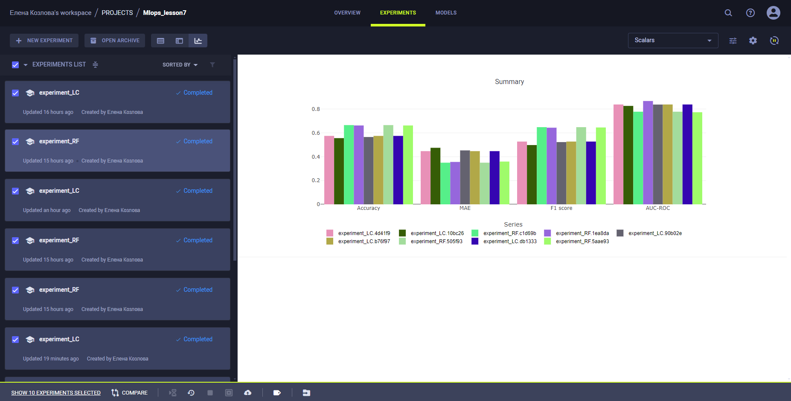
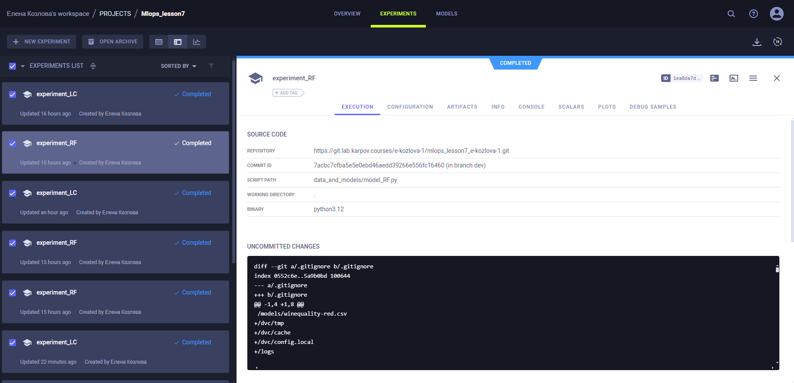

# Финальный проект MLops

##Общая информация
Я "мигрировала" с предыдущего потока, поэтоме часть комитов сделаны еще тогда, в более поздних постаралась доделать проект + навести красоту.

##Структура:
- dags -> Папка с дагом
- data_and_models -> Папка с датасетом, файлами моделей, результатами их обучения и их dvc
- api -> Папка с api и front

##Выбор моделей:
1. RandomForest выбран изходя из результата анализа автора датасета
2. LogisticRegression выбран для контраста чтоб сравнить результат более простой модели с RandomForest

##Трекинг:
Изначально трекинг был в wandb, но начались проблемы с доступом без vpn, заменила на clearml
Ниже длинная ссылка
https://app.clear.ml/projects/6a3323973b16456ea8dd6262eb57e546/experiments/compare/scalars;ids=10bc26d765a143aea803724600ced6ab,1ea8da7d9f3940e0b56d614f6f00708d,4d41f91c90a74197ac8fbfb76b1145f9,505f934b5ecf4f8aa100b1c72ec44afe,5aae936046ba41078582bfdbf2d96636,6b68460748994989bbbdecc87511dc6f,90b02e3eb4d1465284b8e62cc4db0d49,b76f97e79bd9448aa621ab50071be320,c1d69b6129a2494fa40a827e9b99b763,db1333df1bd342c2b6c912816ad10df3?columns=selected&columns=type&columns=name&columns=tags&columns=status&columns=project.name&columns=users&columns=started&columns=last_update&columns=last_iteration&columns=parent.name&order=-last_iteration&filter=
Но для удобства вот скрины с результатами

Общий график с метриками

Сохранение моделей

##DAG:
В dag прописана выгрузка данных из dvc и обучение с обновлением данных в случае более низкой MAE

##API:
Реализовано в соответствии с ранее написанными api и front. При предикте постаралась учесть, что сама модель обучалась на np массивах с применением StandartScaler

##CI:
Добавлены Линтест, проверка dvc и Unit-тест для API
